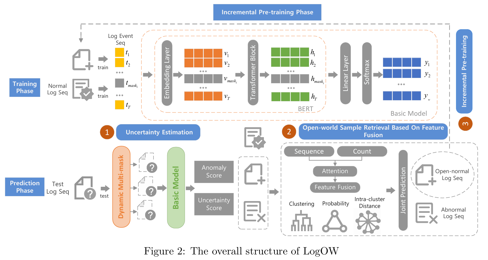

# LogOW: A Semi-Supervised Log Anomaly Detection Model in Open-World Setting

This repository provides the implementation of LogOW for log anomaly detection. 
The process includes downloading raw data online, parsing logs into structured data, 
creating log sequences and finally modeling. 
LogOW's dataset download scripts, bert model loading, 
and baseline were adapted from existing [HelenGuohx/logbert](https://github.com/HelenGuohx/logbert) repository code.

## The overall structure of LogOW



## Configuration
- Ubuntu 20.04
- NVIDIA driver 460.73.01 
- CUDA 11.2
- Python 3.8
- PyTorch 1.9.0

## Installation
This code requires the packages listed in requirements.txt.
An virtual environment is recommended to run this code

On macOS and Linux:  
```
python3 -m pip install --user virtualenv
python3 -m venv env
source env/bin/activate
pip install -r ./environment/requirements.txt
deactivate
```
Reference: https://packaging.python.org/guides/installing-using-pip-and-virtual-environments/

An alternative is to create a conda environment:
```
    conda create -f ./environment/environment.yml
    conda activate logbert
```
Reference: https://docs.conda.io/en/latest/miniconda.html

## Experiment
LogOW and other baseline models are implemented on [HDFS](https://github.com/logpai/loghub/tree/master/HDFS), [BGL](https://github.com/logpai/loghub/tree/master/BGL), [thunderbird]() and our jeegboot data datasets

### HDFS example
```shell script

cd HDFS

sh init.sh

# process data
python data_process.py

# run LogOW
python logbert.py vocab

# pretrain LogOW
options["go_on_pretrain"] = False
python logbert_no_shuffle.py train

# predict without uncertainty
python logbert_no_shuffle.py predict

# Uncertainty Estimation
# predict with uncertainty
python logbert_no_shuffle.py multi_predict

# Open-world Sample Retrieval Based On Feature Fusion
run output/no_shuffle_bgl_325/bert/deal_with_results.ipynb

# Incremental Learning
options["go_on_pretrain"] = True
python logbert_no_shuffle.py train

# predict without uncertainty
python logbert_no_shuffle.py multi_predict

# run logbert
python logbert.py vocab
python logbert.py train
python logbert.py predict

# run deeplog
python deeplog.py vocab
# set options["vocab_size"] = <vocab output> above
python deeplog.py train
python deeplog.py predict 

# run loganomaly
python loganomaly.py vocab
# set options["vocab_size"] = <vocab output> above
python loganomaly.py train
python loganomaly.py predict

# run baselines like PCA, IF, and so on...
baselines.ipynb
```
### Data visualization
```shell
cd View_cls
run GraphViz_BGL.py
```

### Folders created during execution
```shell script 
~/.dataset //Stores original datasets after downloading
project/output //Stores intermediate files and final results during execution
```
